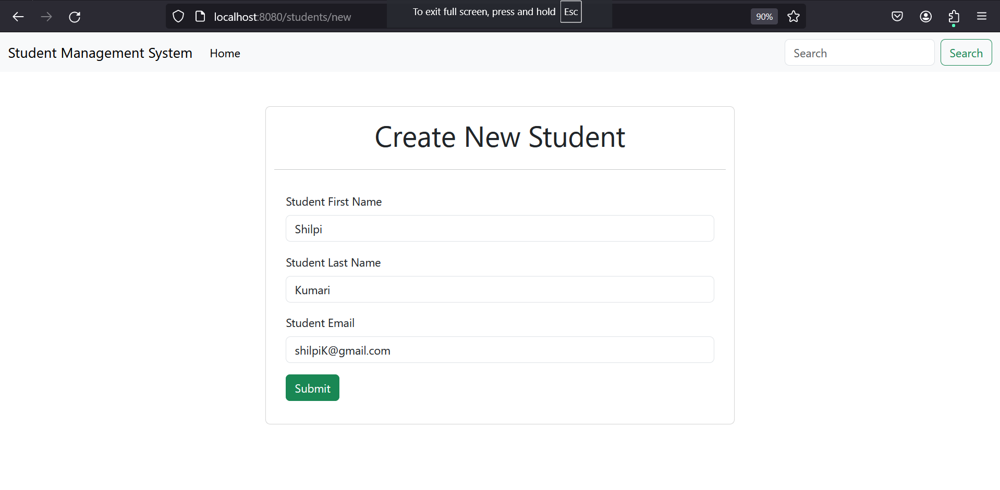
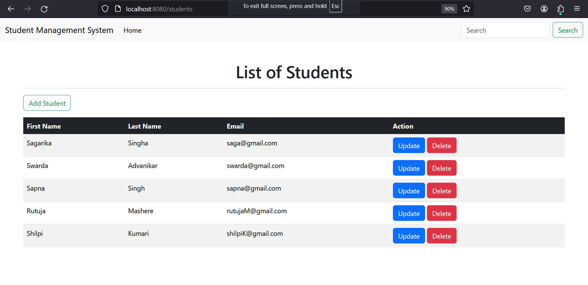
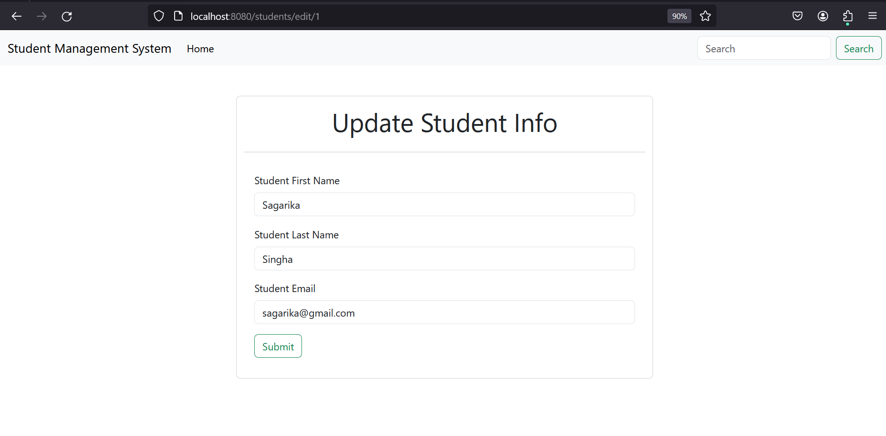
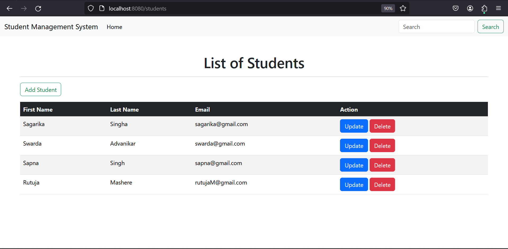

# Student-Management-System
The Student Management System is a web-based application built using Java, Spring Boot, MySQL, and Thymeleaf. This system provides a comprehensive solution for managing student data, including all CRUD (Create, Read, Update, Delete) operations.

